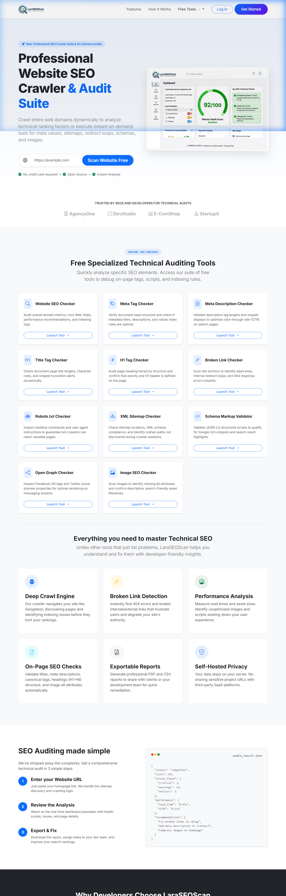
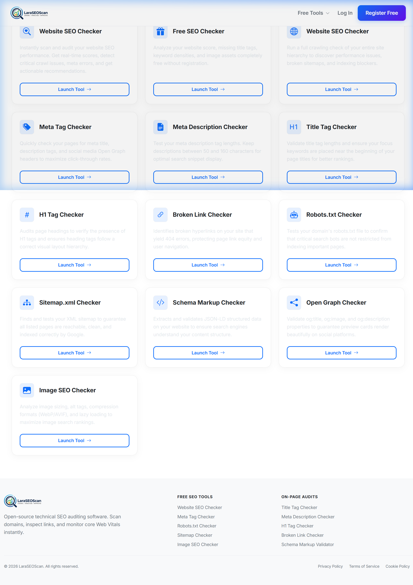
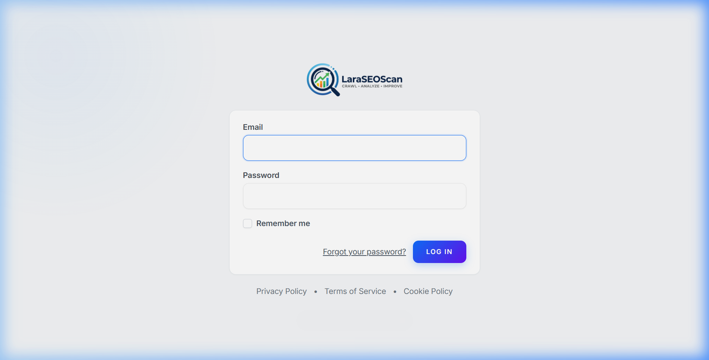
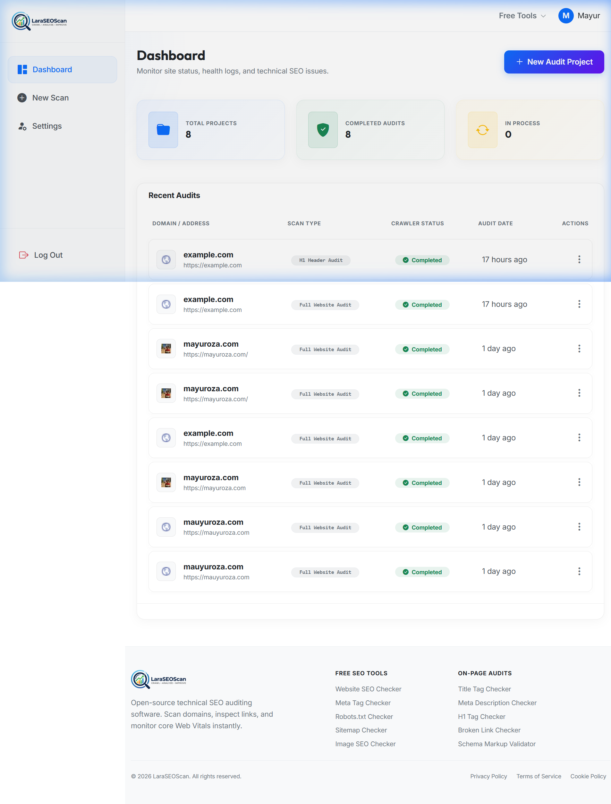
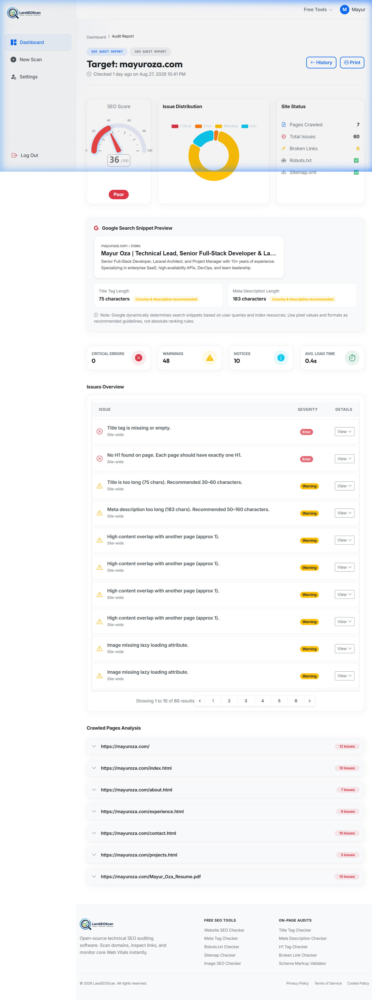

# 🔍 LaraSEOScan

LaraSEOScan is a professional, self-hosted website SEO crawler and technical audit suite built on Laravel 12. Crawl entire domains dynamically to detect ranking blockers, performance warnings, heading hierarchies, broken links, schemas, and images.

---

## 📌 Project Purpose

**LaraSEOScan** is a developer-centric technical SEO platform designed to run private audits on any web page. It maps domain assets, verifies meta tag compliance, checks response codes to eliminate dead ends, and validates structured JSON-LD schemas.

---

## 🚀 Key Features

### 👤 User Features & Session Conversion
- 🔐 **Premium Authentication**: Full user registration, login, and profile settings powered by Laravel Breeze.
- 🔄 **Guest Scan Conversion**: Initial guest scans are dynamically converted and saved to the user's history upon registration.
- 📊 **Interactive Dashboard**: Site overview statistics, completion counters, and interactive chart logs using **ECharts**.
- 📜 **Scan History & Soft Deletes**: Personal audit logs showing favicon icons, scan status badges, and soft-delete capabilities.
- 📅 **Rate Limiting**: Configured scanning limit of **5 project scans per user/day** to prevent infrastructure overload.

### ⚙️ Deep Crawl & Validation Engine
- 🌐 **Robust Crawler**: Googlebot-like domain parsing using Symfony DOMCrawler and Guzzle asynchronous pools.
- 📝 **Core Metadata Inspection**: Validation of Title Tag length proximity rules, Meta Description constraints, and robots indexing directives.
- 🔗 **Broken Link Auditor**: Identifies dead anchors, circular redirects, and 404 response errors across all internal and external anchors.
- 🧾 **Headings Hierarchy Audit**: Validates logical H1–H3 header nesting paths and flags duplicate H1 header warnings.
- 🤖 **Directives Validator**: Validates robots.txt disallow rules, XML Sitemap schemas, and JSON-LD schema structured scripts.
- 📤 **Document Exports**: Download results as clean, styled PDF reports or developer-friendly CSV spreadsheets.

### 🛠️ 11 Specialized On-Demand SEO Checkers
LaraSEOScan provides a dedicated **Technical SEO Tools Hub** including:
1. **Website SEO Checker**: Broad audit of domain metrics, Core Web Vitals, and indexing.
2. **Meta Tag Checker**: Inspects meta title, description, and canonical header tags.
3. **Meta Description Checker**: Validates description tags lengths for snippet previews.
4. **Title Tag Checker**: Checks character count lengths and brand separating metrics.
5. **H1 Tag Checker**: Audits visual hierarchy layouts.
6. **Broken Link Checker**: Finds loops, redirections, and broken anchors.
7. **Robots.txt Checker**: Evaluates User-Agent instructions.
8. **XML Sitemap Checker**: Checks location mapping validity.
9. **Schema Markup Validator**: Validates structured JSON-LD scripts for rich snippet eligibility.
10. **Open Graph Checker**: Previews social share cards.
11. **Image SEO Checker**: Flags missing ALT tags and confirms descriptive filenames.

---

## 🚀 Demo Screenshots

### 1. Homepage UI & Technical Tools Hub


### 2. SEO Tools Hub Listing


### 3. Login Interface (Contrast Optimized)


### 4. User Dashboard


### 5. Detailed Scan Results (mayuroza.com)


---

## Requirements
- PHP 8.2+
- Composer
- Node.js 18+ & npm
- MySQL, PostgreSQL, or SQLite
- GD Extension 
---

## ⚙️ Setup Instructions

1. **Clone the repo**
```bash
git clone https://github.com/mayuroza3/LaraSEOScan.git
cd LaraSEOScan
```

2. **Install dependencies**
```bash
composer install
npm install
npm run build   # Compile assets
```

3. **Configure Environment**
```bash
cp .env.example .env
php artisan key:generate
```
Set up database credentials in your `.env` file:
```env
DB_CONNECTION=mysql
DB_HOST=127.0.0.1
DB_PORT=3306
DB_DATABASE=laraseoscan
DB_USERNAME=root
DB_PASSWORD=
```

4. **Run migrations**
```bash
php artisan migrate
```

5. **Start Queue Worker (Required for Background Crawls)**
```bash
php artisan queue:work
```

6. **Serve the Application**
```bash
php artisan serve
```
Now visit: `http://127.0.0.1:8000`

---

## 🛠️ Tech Stack

- **Laravel 12**
- **Guzzle HTTP** – fetch links and web pages
- **Symfony DOMCrawler** – HTML parsing and DOM inspection
- **Breeze** - authentication scaffolding
- **Bootstrap 5 & Tailwind CSS** – layout styling & custom color schemes
- **ECharts** – interactive data charts
- **MySQL/PostgreSQL** – scan history storage

---

## 🤝 How to Contribute

1. Fork the repo  
2. Create a new branch: `feature/my-feature-name`  
3. Make your changes  
4. Submit a Pull Request 🚀

---

## 🧠 Roadmap
- [ ] Multilingual scan report exports
- [ ] Scheduled crawl jobs with email alerts
- [ ] Search Console & Analytics API integration

---

## 🙌 Author

Created with ❤️ by [Mayur Oza](https://mayuroza.com)  
Follow me on GitHub: [@mayuroza3](https://github.com/mayuroza3)  
Connect on LinkedIn: [Mayur Oza](https://www.linkedin.com/in/mayur-oza/)  
Follow on X: [@mayuroza3](https://x.com/mayuroza3)
